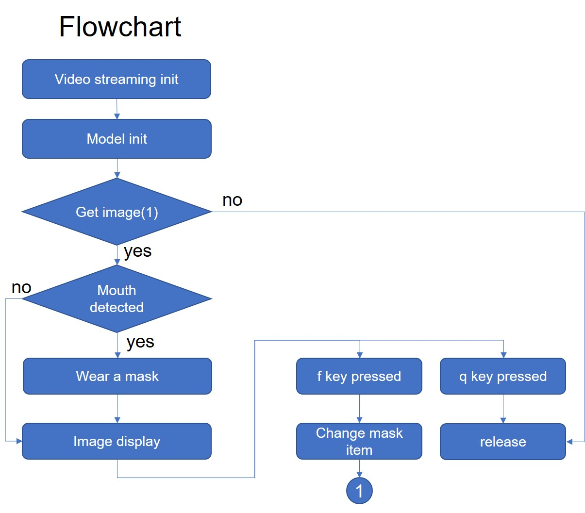

# Dlib_application:Real time wearing mask on your face

●這是應用Dlib的人臉偵測來即時對人臉戴上口罩的[教學](https://youtu.be/sneNIyhggr0)

●使用Dlib一般版本即可，可以不用USE_CUDA版本

●若對Dlib的基本使用不熟悉，可先參考我的[Dlib基本教學](https://youtu.be/4ffqSHtGZas)

●流程圖如下:

■This ia a [tutorial](https://youtu.be/sneNIyhggr0) of real time wearing mask on your face using Dlib.

■The normal Dlib version without GPU support(USE_CUDA) is used.

■If not familiar with Dlib basic usage, please refer to my [tutorial.](https://youtu.be/4ffqSHtGZas)

■The flowchart is shown below:

